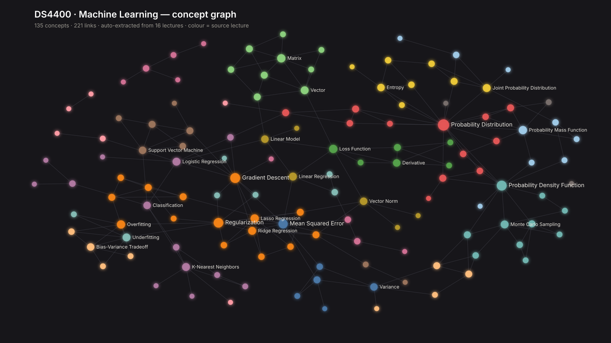

# Canvas Knowledge Graph & Study Assistant

Pulls your Canvas courses into a local Obsidian vault. Lecture slides get transcribed
to markdown, concepts get linked across lectures, and you can ask Claude or Gemini
about any of it with citations back to the actual slide.

Everything stays on your machine as plain markdown.



<sub>Example output: 135 concepts and 221 links pulled out of 16 lectures, coloured by
source lecture. You'd get a graph of your own classes, whatever they are. Nothing here
is subject specific.</sub>

## Setup

```bash
git clone https://github.com/mihirargulkar/canvas-obsidian && cd canvas-obsidian
./setup.sh
```

The script sets up a virtualenv, installs everything, asks for your Canvas token and a
Gemini API key, then offers to run the first sync. Safe to re-run.

Install is about 170MB. Search runs on static embeddings plus BM25, no PyTorch. If
you want slightly better ranking you can `pip install sentence-transformers` and it
gets picked up automatically, at the cost of ~800MB.

You'll need Python 3.10+, a [Canvas token](https://community.canvaslms.com/t5/Student-Guide/How-do-I-manage-API-access-tokens-as-a-student/ta-p/273)
(Account > Settings > New Access Token), a free [Gemini key](https://aistudio.google.com/app/apikey),
and LibreOffice if you want `.pptx` slides read (`brew install --cask libreoffice`).

## Syncing

```bash
.venv/bin/python -m canvas_vault.sync            # all your classes this term
.venv/bin/python -m canvas_vault.sync --list     # just show what it found
```

First run is slow, since every slide deck goes through a vision model, and you might
hit Gemini's free daily limit. That's fine. It caches everything, so run it again and
it picks up where it stopped.

After that, re-running is cheap and tells you what's new. To keep it current without
thinking about it:

```bash
tools/install-daily-sync.sh      # macOS, runs every morning at 07:30
```

## Using it with Claude or Gemini

The vault is exposed over MCP, so your existing Claude subscription or the free Gemini
CLI does the chatting. No API bill.

Claude Code picks it up automatically from `.mcp.json`. For Claude Desktop, add this to
`~/Library/Application Support/Claude/claude_desktop_config.json` and restart it:

```json
{
  "mcpServers": {
    "canvas": {
      "command": "/absolute/path/to/canvas-obsidian/.venv/bin/python",
      "args": ["-m", "canvas_vault.mcp_server"],
      "cwd": "/absolute/path/to/canvas-obsidian",
      "env": { "PYTHONPATH": "/absolute/path/to/canvas-obsidian" }
    }
  }
}
```

Same block works for Cursor (`.cursor/mcp.json`), Gemini CLI (`~/.gemini/settings.json`)
and VS Code (`.vscode/mcp.json`, though it uses `"servers"` instead of `"mcpServers"`).

### Things worth asking

- What's due this week?
- Am I overdue on anything?
- Did I miss any announcements?
- Explain gradient descent the way my professor did, not the textbook version
- Here's the midterm topic list. Which of these do my notes barely cover?
- What do I need to understand before MLE makes sense?
- What is homework 3 actually asking for?

Answers about course content cite the lecture and section they came from, so you can go
check. If something isn't in your notes it'll say so instead of making it up.

This is meant for understanding your own material. How you use it on graded work is
between you and your course's academic integrity policy.

## Where things end up

```
vault/<CLASS>/    concepts, lectures, dashboard    <- open this in Obsidian
vault/Dashboard.md    deadlines across all classes
notes/<CLASS>/    the transcribed markdown
cache/            downloads and sync state, safe to delete
```

All of that is gitignored. It's your data, not the repo's.

## A note on what else exists

There are Canvas MCP servers with far more API coverage than this one, and hosted study
assistants that do RAG over your files. If you just want to talk to Canvas from an LLM,
use one of those. The thing this does differently is build you an actual Obsidian vault:
plain markdown you keep, with concepts linked across lectures, running locally on a
subscription you already pay for.

Your Canvas token stays in `.env` and never leaves your machine. Course content does get
sent to Gemini during transcription, so don't ingest anything you wouldn't want there.
Instructure's terms don't allow sharing your token with third parties, which is fine for
running this yourself but rules out hosting it for other students.

## Development

```bash
.venv/bin/python -m pytest -q
.venv/bin/python tools/eval_graph.py       # scores the concept graph
.venv/bin/python tools/eval_retrieval.py   # scores search, recall@k and MRR
```

Both eval scripts use a hand labelled gold set written for one specific course. Swap in
your own cases if you want them to mean anything for your classes.

Code lives in `canvas_vault/`, tests in `tests/`, dev scripts in `tools/`.

MIT licensed. See [LICENSE](LICENSE).
